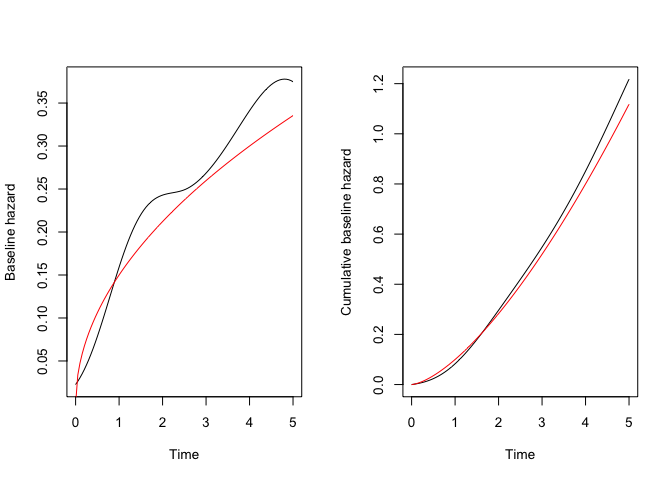

<!-- README.md is generated from README.Rmd. Please edit that file -->

# Survode

<!-- badges: start -->

[](https://github.com/SignorinoY/survode/actions/workflows/R-CMD-check.yaml)
[](https://app.codecov.io/gh/SignorinoY/survode?branch=main)
<!-- badges: end -->

The goal of survode is to implement the method described in Tang et
al. (2022) \[1\] for fitting survival models using ordinary differential
equations. The package is currently under development and is not yet
ready for use.

## Installation

You can install the development version of survode like so:

``` r
# install.packages("devtools")
devtools::install_github("SignorinoY/survode")
```

## Example

This is a basic example which shows you how to solve a common problem:

``` r
library(simsurv)
library(survode)
#> 载入需要的程辑包：survival

# Create a simple data set
set.seed(42)
cov <- data.frame(
  id = 1:400,
  trt = stats::rbinom(400, 1L, 0.5),
  hormon = stats::rnorm(400, 0, 1)
)
dat <- simsurv(
  lambdas = 0.1, gammas = 1.5, betas = c(trt = -0.5, hormon = 1.0),
  x = cov, maxt = 5
)
sim <- merge(cov, dat)

# Fit a Cox model with a spline for the baseline hazard
fit <- survode(Surv(eventtime, status) ~ trt + hormon, data = sim, df = 5)
fit$coefficients$beta
#>        trt     hormon 
#> -0.6693948  0.9394916

# Predict the baseline hazard at times (0, 5)
bh <- predict(fit, type = "hazard", time = seq(0, 5, length.out = 100))
par(mfrow = c(1, 2), cex = 0.85)
plot(
  bh$time, bh$basehaz,
  type = "l", xlab = "Time", ylab = "Baseline hazard"
)
lines(bh$time, 0.15 * bh$time^0.5, col = "red")
plot(
  bh$time, bh$cumhaz,
  type = "l", xlab = "Time", ylab = "Cumulative baseline hazard"
)
lines(bh$time, 0.1 * bh$time^1.5, col = "red")
```



## Code of Conduct

Please note that the survode project is released with a [Contributor
Code of
Conduct](https://contributor-covenant.org/version/2/1/CODE_OF_CONDUCT.html).
By contributing to this project, you agree to abide by its terms.

\[1\] Tang, W. et al. (2022) ‘Survival analysis via ordinary
differential equations’, Journal of the American Statistical
Association, pp. 1–16. Available at:
<https://doi.org/10.1080/01621459.2022.2051519>.
